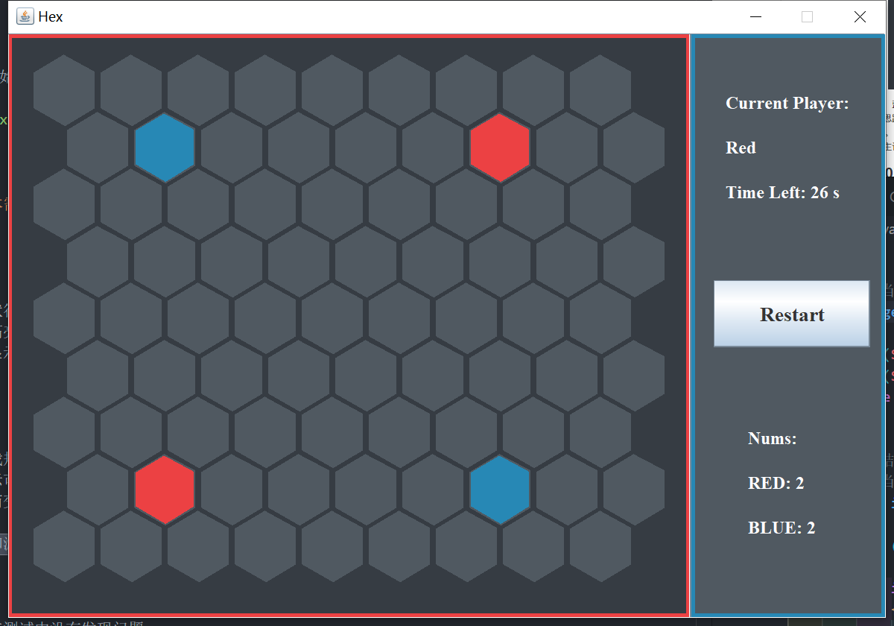
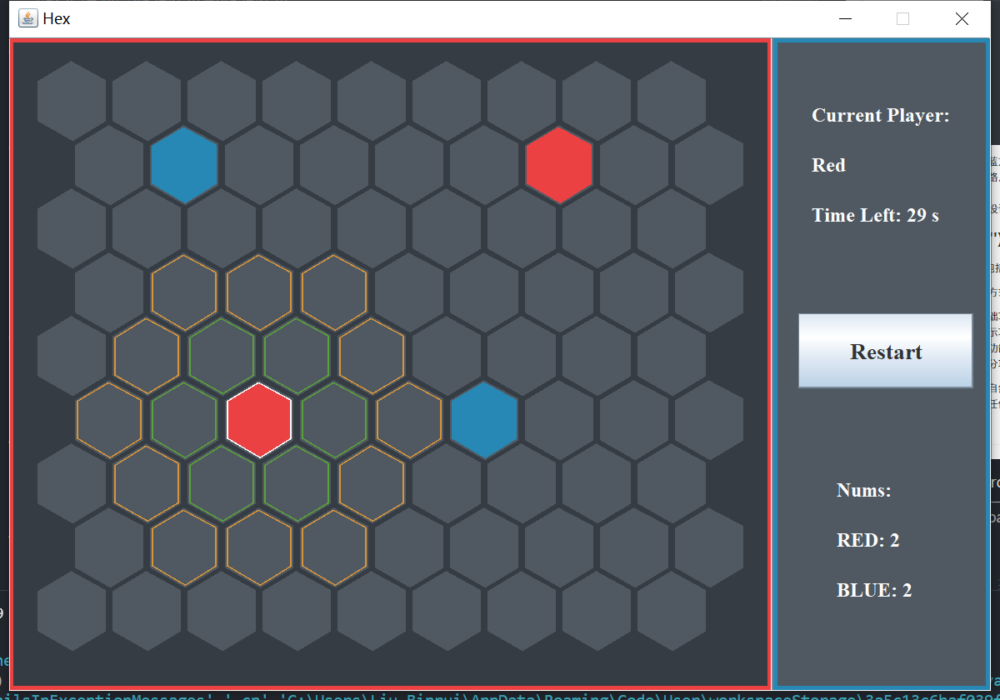

# Hex

清华大学谌卫军老师「Java 程序设计」课程大作业 —— 一个基于 Java Swing 的 Hex 棋类游戏。



## 功能

- 完整的六边形棋盘界面，棋子可通过复制（1 格）或跳跃（2 格）移动
- 落子后自动同化相邻的对方棋子
- 选中棋子时高亮提示可移动位置（绿色 = 复制，橙色 = 跳跃）
- 红蓝双方交替行棋，无子可走时自动结算
- ⏱ 计时模式：每步限时 30 秒，超时判负
- 📊 实时显示双方棋子数量



## 运行

**直接运行（需要 JRE）：**

```bash
java -jar hex.jar
```

**从源码编译：**

```bash
javac -d out src/hex/*.java
java -cp out hex.GUI
```

## 项目结构

```
src/hex/
├── Params.java   # 全局参数（窗口尺寸、颜色、计时等）
├── Board.java    # 棋盘逻辑（Cell 棋盘格 + Board 棋盘）
└── GUI.java      # 图形界面（主窗口、棋盘面板、信息面板）
```

## 游戏规则

1. 点击 **Play** 开始游戏，红方先行
2. 点击己方棋子选中，高亮位置为可落子处
3. **绿色高亮**（1 格内）：复制棋子到目标位置
4. **橙色高亮**（2 格内）：跳跃到目标位置（原位置清空）
5. 落子后，目标位置相邻的对方棋子被同化为己方颜色
6. 当一方无子可走时游戏结束，棋子多者获胜

## 课程信息

- **课程**：Java 程序设计
- **教师**：谌卫军
- **院校**：清华大学
