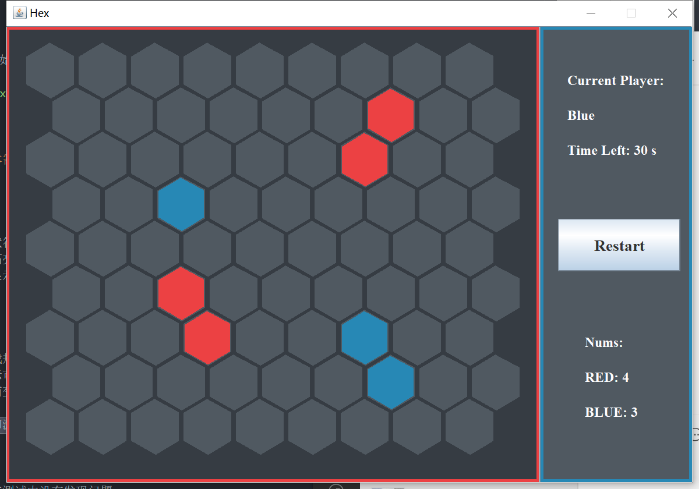
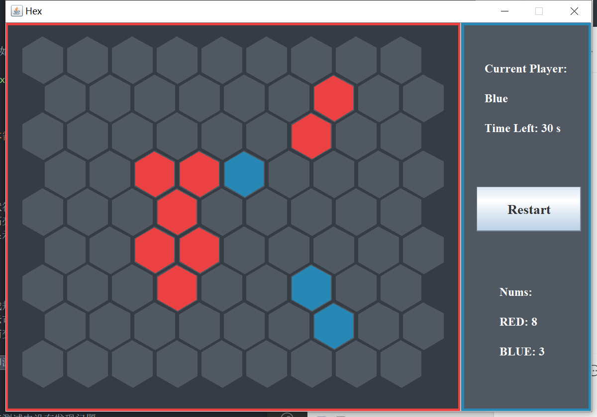
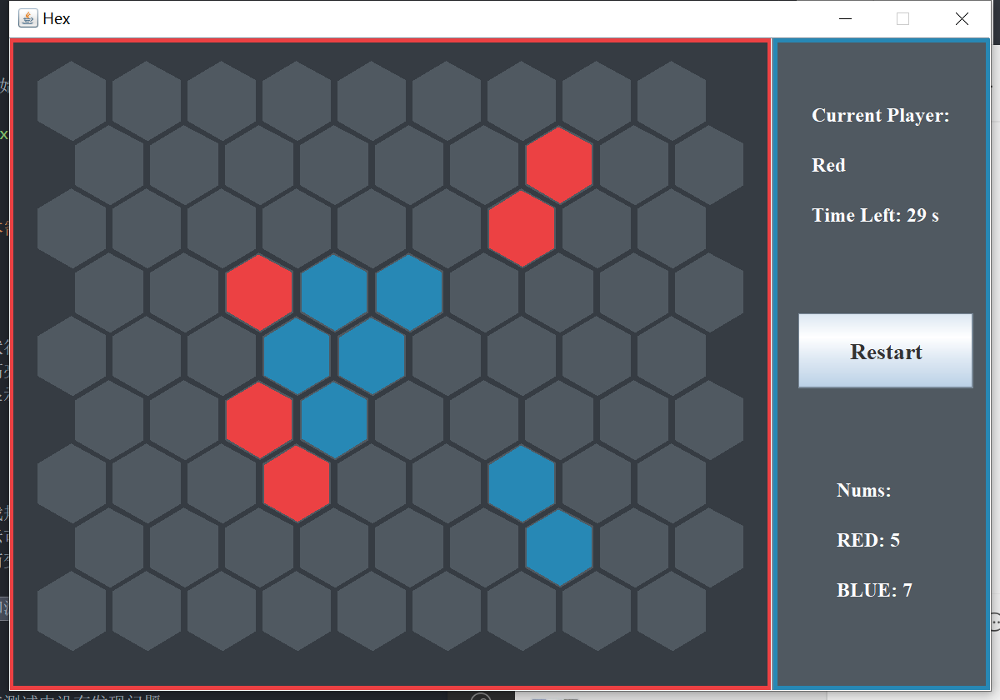
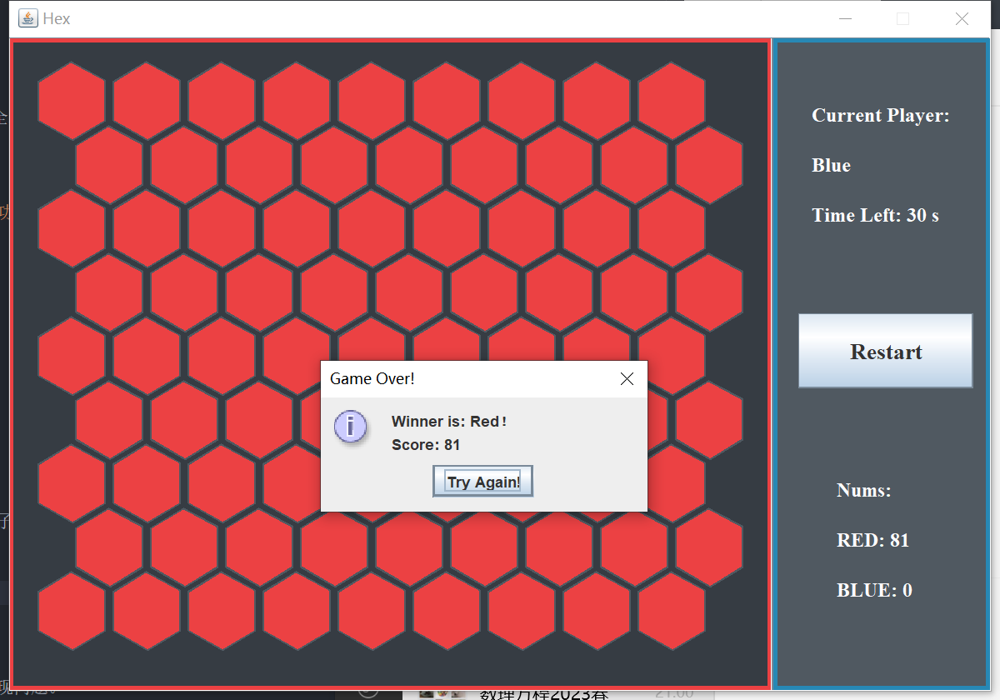
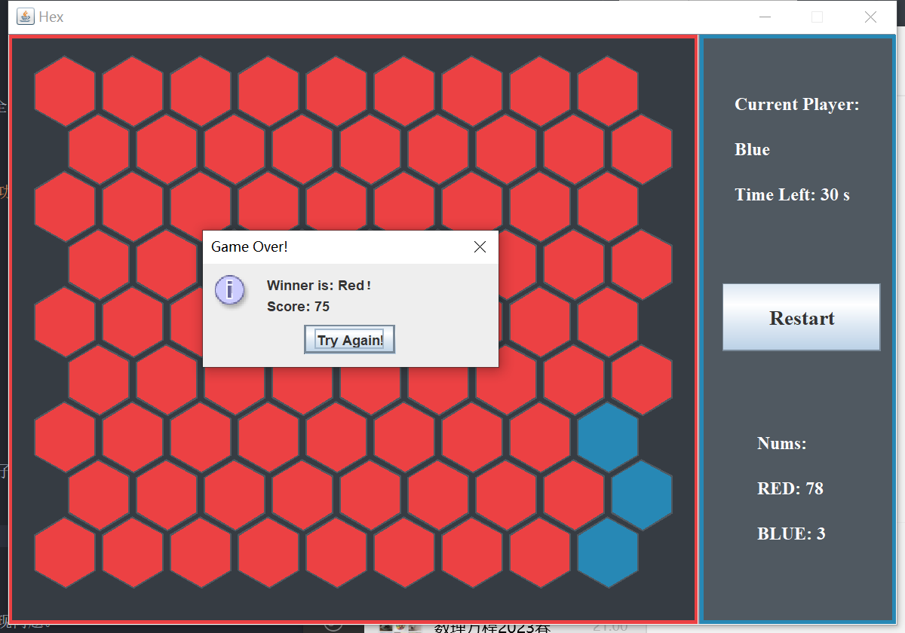
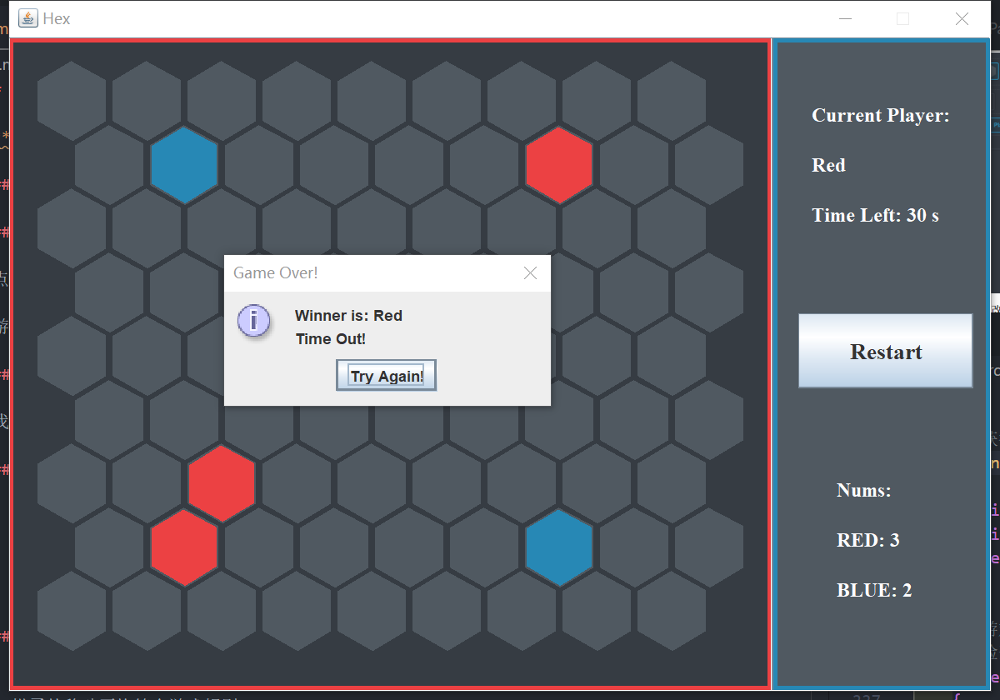

# Report: Hex

**——刘滨瑞 2021012579 未央-水木12**

## Ⅰ 游戏操作说明

### 运行说明

点击`start`按钮，即可开始游戏。

游戏的操作方式与`playhex.online`完全相同。

### 需求实现

我们成功实现了**所有基本需求中要求的功能**。

#### 游戏界面

- 正确、完整的游戏界面
- 棋盘、棋子的颜色与形状符合要求
- 在选中棋子时，有两种高亮提示
- 游戏结束时，能够弹窗显示游戏结果

#### 游戏模型

- 游戏能够正确初始化
- 棋子的移动严格符合游戏规则
- 棋子移动时，有高亮提示可供选择的落子位置
- 棋子能正确地因被俘获而变色
- 红蓝双方始终交替落子
- 能够正确判定游戏结束和游戏结果

#### 性能需求

- 程序运行流畅，稳定，在测试中没有发现问题。

#### 扩展需求

- 实现了**计时模式**，红蓝双方均必须在规定的30s内落子，否则判负。

- 计时器能够正常地计时和复位。

- 实现了**棋子数目统计**。红蓝双方的妻子数量可以实时地显示在信息栏中。

### 运行截图

- 正确的初始化


- 两种距离的棋子移动方式



- 正确的紧临棋子同化




- 游戏结束判定与结果提示




- 计时器与超时判负提示



- 高亮提示


## Ⅱ 程序设计架构

### 目录

```java
└─ 2021012579_刘滨瑞.zip
    │  report.pdf
    │  hex.jar
    └─ src
        └─ hex
            │  Board.java
            │  Params.java
            └─ GUI.java
```

其中，`report.pdf`是实验报告，`hex.jar`是可直接运行的jar包。

`src`文件夹内是所有的源代码。

### 架构简介

#### `src\Param.java`

##### 全局变量类`class Params`

储存程序中所有的重要参数

#### `src\GUI.java`

##### 图形界面主窗口`class GUI`

使用`JSplitPane()`将之划分为了左右两个子窗口。左子窗口是棋盘界面，右子窗口是信息提示界面。

**含有`main()`函数，为程序的入口。**

##### 棋盘界面窗口`class mainPanel`

内含棋盘对象和相应的操作方法。

`settle()`：游戏结算方法，调用后将弹窗提示游戏的结果。
`mouseClicked()`：鼠标点击监听器，读取每次鼠标点击的位置，并在棋盘上执行相应的操作。

##### 信息提示界面窗口`class infoPanel`

内含游戏开始按钮、计时器与统计器。

#### `src\Board.java`

##### 棋盘格类`class Cell`

记录某个棋盘格的坐标与状态信息，含有一些关于棋盘格的操作方法。

`setPos()`：坐标设置方法。
`calDistanceTo()`：计算到另一个棋盘格的距离，用邻接等级表示。
`changeTo()`：更改棋盘格的状态。
`infect()`：同化棋盘格紧临的对方棋子。
`highlight()`：更改棋盘格的高亮状态。
`n1_highlight()`：激发可供移动的1阶邻居。
`n2_highlight()`：激发可供移动的2阶邻居。
`n1_check()`：检查1阶邻居中是否存在某类的棋子。
`n2_check()`：检查2阶邻居中是否存在某类的棋子。
`paintComponent()`：重写的绘图函数。

##### 棋盘类`class Board`

是棋盘格的集合，含有一些棋盘格的统一操作方法。

`launch()`：产生一个新的计时线程，供计时器使用。
`initialize()`：游戏初始化方法。
`next()`：切换行棋玩家。
`release()`：解除所有棋盘格的高亮。
`count()`：统计红蓝棋子的数目，供统计器使用。
`getName()`：获得当前行棋玩家的颜色名。
`isEnd()`：游戏结束判定，在当前玩家不能继续行棋时返回true。

## Ⅲ 复杂功能的实现思路

### 计时器

我们单独定义了一个计时线程，在游戏初始化时启动。
该线程负责维护变量`time_left`，每秒将`time_left`减1。而在游戏开始时和更换行棋方时，`time_left`会重置为初始值`30`。
在信息窗口中有一个监测线程，当`time_left`归零时，该线程会终止游戏，并弹窗给出相应提示。

### 邻近棋盘格的表示

我们在定义棋盘格类时，直接将其一阶邻居和二阶邻居的引用储存在一个`Hashset`中。这样就避免了使用繁琐的坐标方式表示棋盘格的相对位置。
